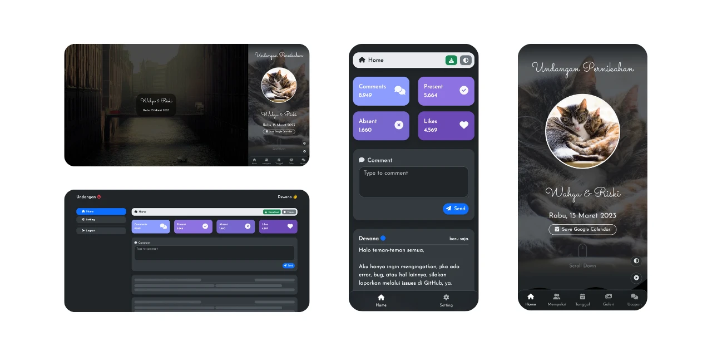

# 💌 WeddingInvitation.com - Mẫu Website Thiệp Cưới Digital



[](https://app.netlify.com/sites/ulems/deploys)
[](https://cie.my.id)
[](https://shields.io)
[](https://shields.io)

## 📖 Tổng quan dự án

**WeddingInvitation.com** là một mẫu website thiệp mời đám cưới trực tuyến thanh lịch và hiện đại. Dự án được xây dựng bằng HTML, CSS (Bootstrap 5) và JavaScript thuần (Vanilla JS), mang lại trải nghiệm mượt mà, tối ưu trên cả thiết bị di động và máy tính bàn. Mẫu thiệp cung cấp các tính năng tương tác phong phú như đếm ngược thời gian, lịch sự kiện, xác nhận tham dự (RSVP), sổ lưu bút (bình luận), phát nhạc nền và hiệu ứng hoạt ảnh bắt mắt.

### Bản Demo
Xem trước giao diện thực tế của thiệp mời:
👉 [https://d4m-dev.github.io/WeddingInvitation.com/](https://d4m-dev.github.io/WeddingInvitation.com/)

---

## 📁 Cấu trúc thư mục

Dự án có cấu trúc rõ ràng, phân chia các thành phần tĩnh, động và logic thành từng thư mục chuyên biệt:

```text
WeddingInvitation.com/
│
├── .github/workflows/       # Cấu hình CI/CD (GitHub Actions)
├── src/                     # Mã nguồn chính của dự án
│   ├── assets/              # Chứa tài nguyên đa phương tiện tĩnh
│   │   ├── images/          # Hình ảnh, banner, gallery, placeholder
│   │   ├── music/           # Nhạc nền cho thiệp mời
│   │   └── video/           # Video câu chuyện tình yêu
│   ├── css/                 # Các tệp stylesheet (admin.css, guest.css, animation.css, ...)
│   ├── favicon/             # Icons và manifest cho ứng dụng Web/PWA
│   └── js/                  # Mã nguồn JavaScript cốt lõi
│       ├── admin.js         # Entry point (file chính) cho giao diện quản trị
│       ├── guest.js         # Entry point (file chính) cho giao diện thiệp mời khách
│       ├── app/             # Chứa logic giao diện người dùng
│       │   ├── admin/       # Giao diện, xác thực của trang Dashboard
│       │   ├── components/  # Các component tái sử dụng (Bình luận, Phân trang, Gif, Likes)
│       │   └── guest/       # Xử lý âm thanh, video, tiến trình tải trang thiệp mời
│       ├── common/          # Các tiện ích chung, quản lý Storage, Session, Offline mode
│       ├── connection/      # Xử lý HTTP requests, gọi API và Caching
│       └── libs/            # Script hỗ trợ tải thư viện bên ngoài (Confetti, AOS)
│
├── index.html               # Trang chủ: Giao diện thiệp mời công khai
├── dashboard.html           # Trang quản trị: Nơi quản lý bình luận và RSVP (Cần Backend API)
├── package.json             # Quản lý thư viện (NPM) và các câu lệnh thực thi (scripts)
├── eslint.config.mjs        # Cấu hình ESLint (Linter kiểm tra mã nguồn JavaScript)
├── server.py                # Script Python tạo server web mô phỏng nhanh
└── deploy.py                # Script hỗ trợ triển khai
```

---

## ⚙️ Công nghệ sử dụng

- **Giao diện:** HTML5, CSS3, [Bootstrap 5.3.8](https://getbootstrap.com/)
- **Logic:** Vanilla JavaScript (ES6+)
- **Build tool:** [esbuild](https://esbuild.github.io/) (đóng gói JS và tối ưu hiệu suất)
- **Hoạt ảnh & Hiệu ứng:** [AOS 2.3.4](https://michalsnik.github.io/aos/) (Animate On Scroll), [Canvas Confetti 1.9.3](https://www.kirilv.com/canvas-confetti/)
- **Icon & Fonts:** [Fontawesome 7.1.0](https://fontawesome.com/), Google Fonts

---

## 🛠️ Cài đặt & Sử dụng

1. **Cài đặt thư viện (Dependencies):**
   Mở terminal tại thư mục gốc của dự án và chạy:
   ```bash
   npm install
   ```

2. **Khởi chạy môi trường phát triển (Development):**
   ```bash
   npm run dev
   ```
   Lệnh này sẽ khởi động `esbuild` ở chế độ theo dõi (watch mode). Bạn có thể mở `http://localhost:6789` để xem website.

3. **Tùy chỉnh nội dung:**
   - Thay ảnh/âm thanh trong thư mục `src/assets/`.
   - Cập nhật thông tin cô dâu, chú rể, thời gian, và địa điểm trực tiếp trên tệp `index.html`.
   - **Ghi chú về tính năng bình luận:** 
     - Nếu không dùng API, hãy xoá thuộc tính `data-url` và `data-key` trong thẻ `<body>` của `index.html`.
     - Nếu muốn dùng GIF, bạn cần thiết lập khoá API Tenor (Google).
     - Nếu có Backend API, hãy điền URL vào `data-url` và API key tương ứng vào `data-key` trên `index.html` và `dashboard.html`.

---

## 🚀 Triển khai (Deployment)

Khi dự án đã sẵn sàng triển khai (Deploy) lên các dịch vụ hosting (Netlify, Vercel, GitHub Pages,...), hãy sử dụng lệnh sau để build:

```bash
npm run build:public
```

Hệ thống sẽ tự động đóng gói JS (minify), tạo ra thư mục `public/` và sao chép toàn bộ các tài nguyên cần thiết. Nhiệm vụ của bạn chỉ là tải toàn bộ thư mục `public/` này lên hosting.

> [!WARNING]  
> Hãy chắc chắn rằng bạn đang sử dụng Node.js phiên bản tương thích và giữ cấu hình build ổn định để tránh lỗi giao diện.

---

## 💡 Nguồn tài nguyên

- Dự án gốc được tham khảo và chỉnh sửa từ mã nguồn mở [undangan](https://github.com/dewanakl/undangan).
- Tất cả tài nguyên hình ảnh được lấy miễn phí từ [Pixabay](https://pixabay.com/).

## 📜 Giấy phép (License)

Thiệp mời này là một phần mềm mã nguồn mở được cấp phép theo tiêu chuẩn **MIT License**. Bạn có thể thoải mái sao chép, chỉnh sửa và sử dụng.